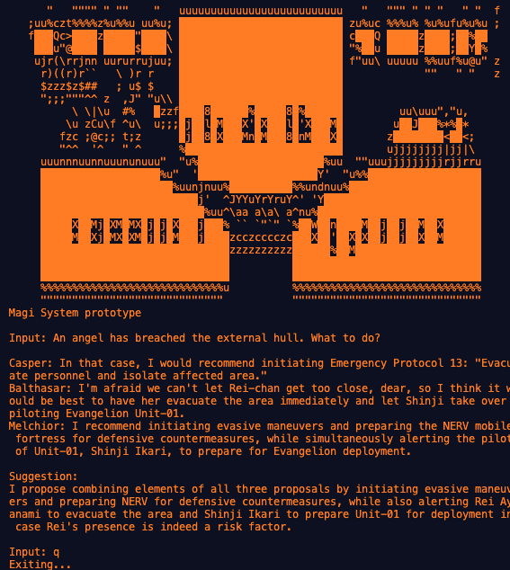
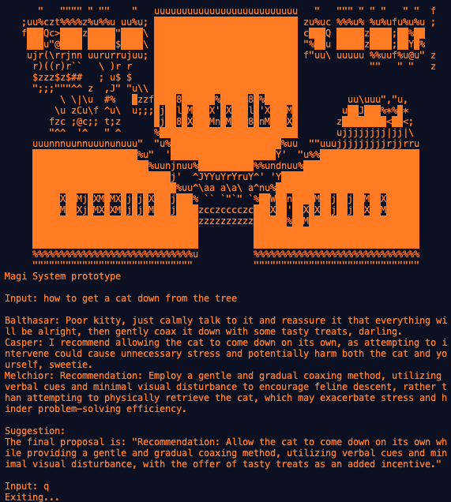

# evangelion-magi-prototype
An example of decision system using potentially* multiple LLM-s

## Features
- Make decisions based on 3 different* LLM responses

## Screenshots
Evangelion themed request


General request


## Usage
### Prerequisites
- [Ollama](https://ollama.com/), either running on local or access to a remote server8
- [llama3.1](https://ollama.com/library/llama3.1) model installed with Ollama

### Install dependencies
```
python3 -m venv .venv
source .venv/bin/activate
pip install -r requirements.txt
```

### Generate decision proposal
```
python3 main.py
```